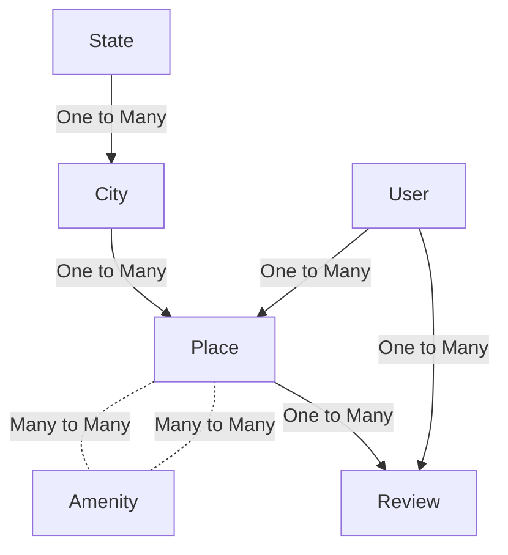

# HBNB - Airbnb Fullstack Clone


## Project Overview:

The Airbnb Fullstack Clone project aims to replicate Airbnb's functionality, covering frontend, backend, database, API, and server setup. It utilizes:

- Frontend: HTML, CSS, JavaScript
- Backend: Python (Flask)
- Database: MySQL, SQLAlchemy
- API: RESTful APIs
- Server: Flask development server, possibly NGINX and HAProxy for production.

**Milestones include:**  
1- Model Creation and Testing Console (JSON)  
2- Static Web Development (HTML/CSS)  
3- Database Setup with MySQL and SQLAlchemy  
4- Dynamic Web Development and API Implementation with Flask and JavaScript.

Additionally, unittests were conducted to ensure the system's reliability and robustness before configuring the firewall. This project offers hands-on experience in integrating various components into a unified system.

## Entity Relationship Diagram (ERD)

The following diagram illustrates the relationships between different entities in the HBNB project:



## In case you wanna try it locally:

**1- Environment setup to run it locally:**

```code
**Install and activate venv**
$ sudo apt-get install python3.8-venv
$ python3 -m venv venv
$ source venv/bin/activate
--------------------

**Install Flask**
$ pip3 install Flask
--------------------

**Install MySQLdb module version 2.0.x***
$ sudo apt-get install python3-dev
$ sudo apt-get install libmysqlclient-dev
$ sudo apt-get install zlib1g-dev
$ sudo pip3 install mysqlclient
$ sudo pip3 install SQLAlchemy
$  sudo apt-get install python3-mysqldb
...
$ python3
>>> import MySQLdb
>>> MySQLdb.version_info
(2, 0, 3, 'final', 0)
--------------------

**Install SQLAlchemy module version 1.4.x***
$ sudo pip3 install SQLAlchemy
...
$ python3
>>> import sqlalchemy
>>> sqlalchemy.__version__
--------------------

**Install flassger and flask_CORS***
$ sudo apt-get install -y python3-lxml
$ sudo pip3 install flask_cors
$ sudo pip3 install flasgger
--------------------

**Create some data using mysql REPL***
>>> Copy the sql lines in the dump.sql file and run them in the mysql REPL.
--------------------
```

**2- Run the api server**

```code
HBNB_MYSQL_USER=hbnb_dev HBNB_MYSQL_PWD=hbnb_dev_pwd HBNB_MYSQL_HOST=localhost HBNB_MYSQL_DB=hbnb_dev_db HBNB_TYPE_STORAGE=db HBNB_API_HOST=0.0.0.0 HBNB_API_PORT=5001 python3 -m api.v1.app
```

**3- Run the web dynamic server based on the DB**

```code
HBNB_MYSQL_USER=hbnb_dev HBNB_MYSQL_PWD=hbnb_dev_pwd HBNB_MYSQL_HOST=localhost HBNB_MYSQL_DB=hbnb_dev_db HBNB_TYPE_STORAGE=db python3 -m web_dynamic.hbnb
```

**3- Finally browse it locally: http://127.0.0.1:5000/hbnb**

## In case you just wanna test the models:

```code
**You can use file.json as a storage and console.py to CRUD models**
$ ./console.py
**And then have fun in the customized REPL, file.json will be created automatically.**
```
