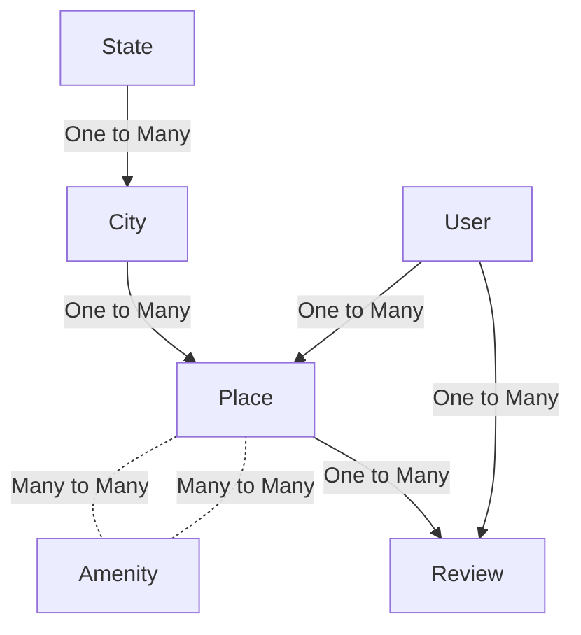

# HBNB - Airbnb Fullstack Clone


## Project Overview:

The Airbnb Fullstack Clone project aims to replicate Airbnb's functionality, covering frontend, backend, database, API, and server setup. It utilizes:

- Frontend: HTML, CSS, JavaScript, JQuery
- Backend: Python, Flask
- Database: MySQL, SQLAlchemy
- API: RESTful APIs
- Server: Flask development server, possibly NGINX and HAProxy for production.

**Milestones include:**  
1- Model Creation and Testing Console (JSON) [AirBnB_clone Repo](https://github.com/samehelgazar95/AirBnB_clone)  
2- Static Web Development (HTML/CSS) [AirBnB_clone_v2 Repo](https://github.com/samehelgazar95/AirBnB_clone_v2)  
3- Database Setup with MySQL and SQLAlchemy [AirBnB_clone_v3 Repo](https://github.com/samehelgazar95/AirBnB_clone_v3)  
4- Dynamic Web Development and API Implementation with Flask and JavaScript. [AirBnB_clone_v4 Repo](https://github.com/samehelgazar95/AirBnB_clone_v4)

Additionally, unittests were conducted to ensure the system's reliability and robustness before configuring the firewall. This project offers hands-on experience in integrating various components into a unified system.

## Entity Relationship Diagram (ERD)

The following diagram illustrates the relationships between different entities in the HBNB project:



## If You Want to Try It Locally:

**1- Local Environment Setup:**

```code
**Install and activate venv**
$ sudo apt-get install python3.8-venv
$ python3 -m venv venv
$ source venv/bin/activate
--------------------

**Install Flask**
$ pip3 install Flask
--------------------

**Install MySQLdb module version 2.0.x***
$ apt-get install python3-dev
$ apt-get install libmysqlclient-dev
$ apt-get install zlib1g-dev
$ pip3 install mysqlclient
$ pip3 install SQLAlchemy
$ apt-get install python3-mysqldb
...
$ python3
>>> import MySQLdb
>>> MySQLdb.version_info
(2, 0, 3, 'final', 0)
--------------------

**Install SQLAlchemy module version 1.4.x***
$ pip3 install SQLAlchemy
...
$ python3
>>> import sqlalchemy
>>> sqlalchemy.__version__
--------------------

**Install flassger and flask_CORS***
$ apt-get install -y python3-lxml
$ pip3 install flask_cors
$ pip3 install flasgger
--------------------

**Create some data using mysql REPL***
>>> Copy the sql lines in the dump.sql file and run them in the mysql REPL.
--------------------
```

**2- Start the API Server**

```code
HBNB_MYSQL_USER=hbnb_dev HBNB_MYSQL_PWD=hbnb_dev_pwd HBNB_MYSQL_HOST=localhost HBNB_MYSQL_DB=hbnb_dev_db HBNB_TYPE_STORAGE=db HBNB_API_HOST=0.0.0.0 HBNB_API_PORT=5001 python3 -m api.v1.app
```

**3- Launch the Dynamic Web Server Based on the Database**

```code
HBNB_MYSQL_USER=hbnb_dev HBNB_MYSQL_PWD=hbnb_dev_pwd HBNB_MYSQL_HOST=localhost HBNB_MYSQL_DB=hbnb_dev_db HBNB_TYPE_STORAGE=db python3 -m web_dynamic.hbnb
```

**4- Finally, Browse It Locally: [http://127.0.0.1:5000/hbnb](http://127.0.0.1:5000/hbnb)**

## If You Just Want to Test the Models:

```code
$ ./console.py
To use `file.json` as a storage and `console.py` to CRUD models:
You can then explore the customized REPL, with `file.json` created automatically.
```
